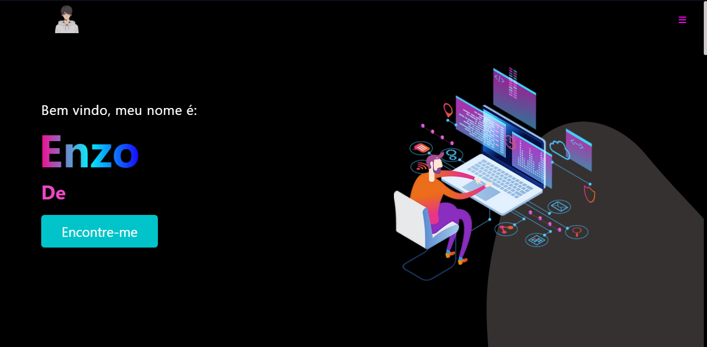

<h1 align="center">🚧 Esse é meu portfólio antigo, como mudei o nome do repo o site não vai abrir, para ver meu portfolio clique <a href="https://portfolio-enzosylvestrin.vercel.app">aqui</a> 🚧</h1> 

## 📚 Seções

O site é composto por sete seções:

- **Home:** Apresentação inicial;
- **Sobre:** Descrição dizendo um pouco sobre quem eu sou;
- **Skills:** Seção que mostra as minhas habilidades;
- **Serviços:** Exibe através de cards os diferentes serviços em que possuo conhecimentos;
- **Certificados:** Meus certificados;
- **Projetos:** Apresenta alguns projetos desenvolvidos e com link direto para os respectivos códigos no GitHub;
- **Contato:** Formas de entrar em contato comigo, incluindo um formulário para me enviar um email;

## 🙃 Funcionalidades extras

- No menu o usuário consegue alterar o tema clicando no ícone da lua ou do sol;
- Ainda no menu é possível alterar a cor do degradê do site, clicando sobre as cores.

---

## 💼 Tecnologias utilizadas

Para o desenvolvimento deste site utilizei as seguintes tecnologias:

- HTML;
- CSS;
- JavaScript;
- React;

---

<h2>👻 Autor</h2>

<table>
  <tr>
    <td align="center">
      <a href="https://github.com/EnzoSylvestrin">
         
        
          <b>Enzo Sylvestrin</b>
        
      </a>
    </td>
  </tr>
</table>
